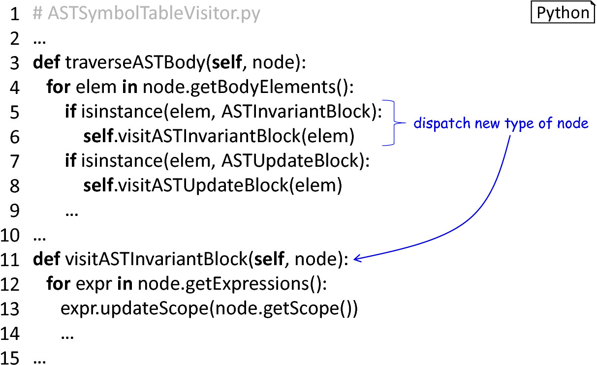

## Section 4: Extending PyNestML 

As typical for all types of software, requirements of the implementation often change. PyNestML was implemented with the aim to provide a modular and easy to extend framework which can be adjusted and reconfigured by exchanging components, e.g., context conditions and reference converters. In this section, we will briefly demonstrate how extensions to PyNestML can be implemented. Representing components which are often adapted, the following use cases are introduced:

-   Grammar: How can the grammar artifacts be extended and in consequence which components have to be adapted?

-   Context Conditions: How can new semantical rules be introduced?

-   Code Generation: How can the code generator be extended?

All three scenarios represent use cases which often occur when new types of supported concepts are introduced.

### Section 4.1: Modifying the Grammar 

The following (hypothetical) use case illustrates the extension of the grammar: A new type of block shall be introduced. Declaring constraints which have to hold in each simulation step, this block contains boolean expressions representing invariants of the neuron model. It is therefore first necessary to extend PyNestML’s grammar to support a new type of blocks. [Figure 4.1](#fig4.1) illustrates how a new grammar rule is introduced to support this use case.

<b>Figure 4.1</b>: New grammar rules: In order to include a new grammar rule, the existing *body* production is extended by a reference to the extension. The *invariantBlock* production encapsulates the added concept.

The grammar artifacts represent the starting point of each DSL. Consequently, all modification to the grammar have to be propagated to components which depend on its structure, namely:

-   The lexer and parser used to parse a model to a parse tree.

-   The AST classes storing details retrieved from the parse tree.

-   The base visitor as well as the *ASTBuilderVisitor* classes.

-   The symbol table building visitor as encapsulated in the *ASTSymbolTableVisitor*.

In [Section 1](front.md) we introduced how a manual implementation process of the lexer and parser can be avoided by utilizing Antlr. By executing Antlr on the modified grammar artifact, an implementation of the lexer and parser adapted to the extensions is generated. Together, these components are used to create the parse tree representation of a model. Proceeding, it is now necessary to provide a mutable data structure which is able to hold details retrieved from the parse tree. A new *ASTInvariantBlock* class is therefore implemented which holds all details of the new rule. As shown in [Figure 4.1](#fig4.1), each invariant block consists of a set of expressions. Consequently, the *ASTInvariantBlock* class features an attribute which stores lists of *ASTExpression* objects. Together with a set of data retrieval and modification operations, this class represents a data structure which is able to hold all invariants of a neuron model.

Having a modified metamodel, it remains to adapt PyNestML to retrieve invariants from the parse tree. PyNestML delegates the initialization of an AST to the *ASTBuilderVisitor* class, cf. [Section 1](front.md). [Figure 4.2](#fig4.2) illustrates how the AST-building routine has to be adapted to regard the new *invariant* block. Here, it is also necessary to extend the existing *visitASTBody* rule to include the instantiation of *ASTInvariantBlock* nodes.
 

<b>Figure 4.2</b>: Modifying the AST builder: In order to initialize an AST according to the new grammar, the *ASTBuilderVisitor* is extended by an *ASTInvariantBlock*-node building method. An adaptation of the existing *visitASTBody* method includes the new rule.

With the modified structure of an AST where a new type of node has been added, it is also necessary to adapt the *ASTVistor* class. Implementing a basic traversal routine on the AST, here it is crucial to include an additional traversal method for the new type of AST node as well as the corresponding *visit* routine. Both methods can then be extended in concrete visitors in order to interact with the *invariant* block. As illustrated in [Figure 4.3](#fig4.3), all extensions are focused on a small set of methods. Besides a modification of the dispatcher methods, individual monomorphic functions are added.

<b>Figure 4.3</b>: Modifying the AST visitor: The *ASTVisitor* class is adapted to support the new type of AST node. The dispatcher functions are adapted, while new monomorphic hook methods are added.

An initialized AST represents a base for further checks and modifications. [Section 1](front.md) illustrated how semantical checks are implemented by means of a symbol table and a set of context conditions. With a new type of block, it is, therefore, necessary to adapt the symbol table building routine. Extending the *ASTVisitor* class, all modifications are focused in the *ASTSymbolTableVisitor*. [Figure 4.4](#fig4.4) illustrates how the symbol table construction routine has to be adapted.

<b>Figure 4.4</b>: Adapting the *ASTSymbolTableVisitor*: The *traverseASTBody* method is extended to regard the new type of block, while the actual handling of the block is delegated to the *visitASTInvariantBlock* method.

Together, these steps enable PyNestML to parse a model containing the new *invariant* block, construct the respective AST and populate the symbol table with all required details.

### Section 4.2: Adding Context Conditions 
Whenever a DSL is extended by new concepts, it also becomes necessary to regard additional semantic rules. In the case of the *invariant* block, it is essential to ensure that only boolean expressions have been stated in this type of block. With an initialized AST, this property can be easily checked by a new context condition. Whenever new semantic rules are established, it is therefore necessary to implement the following adaptations:

- A new context condition implementing all required context checks.
- A modification of the coordinating *CoCosManager* class.

In order to achieve modularity, each context condition is encapsulated in an individual class. The new *CoCoInvariantBlockCorrectlyTyped* class, therefore, implements all processes as required to check the handed over AST for correctness. Concrete checks are delegated to the *InvariantTypeCheckVisitor* class. Extending the *ASTVisitor*, this class implements a routine which visits the *ASTInvariantBlock* node of a given AST and iterates over all stated expressions. [Section 1](front.md) illustrated a preprocessing of the AST where the types of all expressions have been derived. It therefore only remains to check whether a boolean expression has been stated. [Figure 4.5](#fig4.5) outlines how these modifications are implemented.

<b>Figure 4.5</b>: Adding context conditions: Each context condition is implemented in a self-contained class with all required functionality to check the context.

PyNestML delegates the task of checking models for semantical correctness to the orchestrating *CoCosManager* class. Storing references to all implemented context conditions, this class encapsulates all implemented semantical checks. It is, therefore, necessary to extend this class by a reference to the above-introduced *CoCoInvariantBlockCorrectlyTyped*. Whenever a processed model is checked, all context conditions are consecutively invoked on the AST and errors are reported. [Figure 4.6](#fig4.6) illustrates how the *CoCosManager* class has to be extended to regard a new context condition.

<b>Figure 4.6</b>: Extending the *CoCosManager*: New context conditions have to be made known to the managing *CoCosManager* class.

### Section 4.3: Modifying the code-generating Backend 

With the introduction of new concepts to the model-processing frontend, it is also often intended to generate new artifacts or additional code. Extensions are hereby focused in the employed templates which depict how code has to be generated. In the case of the *invariant* block as introduced in the previous section, it is necessary to extend the existing set of templates to enable a generation of invariants in C++ code. The modularity of templates enables an easy to extend structure where additional concepts can be included by implementing sub-templates. Moreover, new templates can be composed of existing ones. Modifications to the code-generating backend are hereby conducted in the following components:

-   New templates which embody additional code that has to be generated.

-   The governing templates in order to include the extensions.

As illustrated in [Figure 4.7](#fig4.7), the existing *NeuronClass* template is extended by a new *invariant* function which checks all stated invariants during the execution of the simulation. JinJa2 as the underlying generator engine of PyNestML features concepts for template inclusion and therefore enables an easy extension of PyNestML’s code generator. The referenced template is hereby implemented as a new artifact.

<b>Figure 4.7</b>: Inclusion of new templates: The existing set of templates is modified to include additional templates. For the sake of modularity, each extension should be implemented in an individual artifact.

In conclusion, it is sufficient to implement all extensions in individual templates and include them by the above-demonstrated mechanism.

Back to [overview](doc.md).
