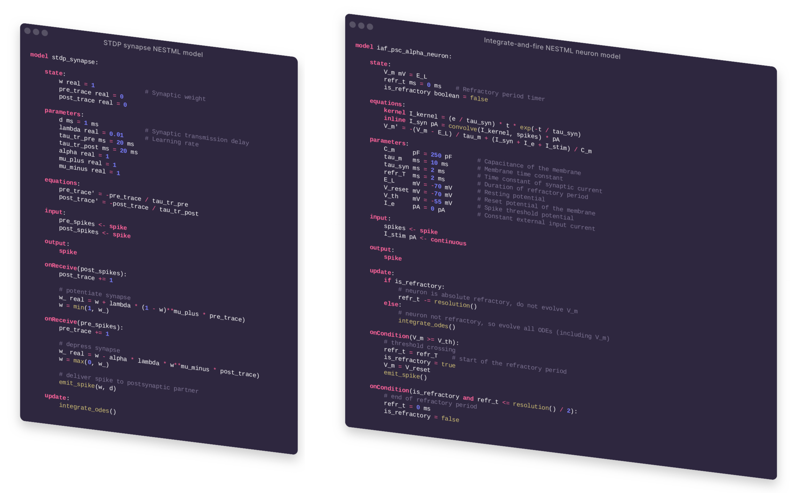

Pretty code rendering
=====================

*NESTML features supported:* :doc:`neurons </nestml_language/neurons_in_nestml>`, :doc:`synapses </nestml_language/synapses_in_nestml>`

Generates "pretty" rendered code for PR purposes. Output format is in HTML + CSS; use any browser to view the generated HTML file(s) and take a screenshot.

Example renders
---------------

Two example files are available: a `neuron model <https://github.com/nest/nestml/blob/master/pynestml/codegeneration/resources_pretty_render/nestml_code_render_neuron.nestml>`_ and a `synapse model <https://github.com/nest/nestml/blob/master/pynestml/codegeneration/resources_pretty_render/nestml_code_render_synapse.nestml>`_. The rendered output for these models is shown below (merged side-by-side).

