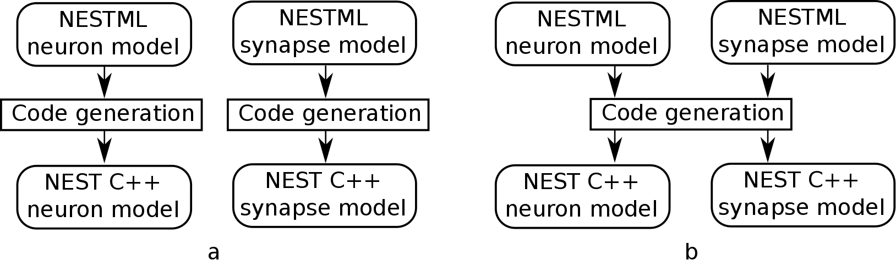

Modeling synapses in NESTML
===========================

A synapse shares many of the same behaviours of a neuron: it has parameters and internal state variables, can communicate over input and output ports, and its dynamics and responses can be described by differential equations, kernels and as an algorithm. Typically, there is a single spiking input port and a single spiking output port.

.. Attention:: The NEST Simulator platform target has some additional constraints, such as precluding updates on a regular time grid. See :ref:`The NEST target` for more details.

Key to writing the synapse model is the requirement that the event handler for the spiking input port is responsible for submitting the event to the (spiking) output port.

Writing the NESTML model
########################

Input and output ports
----------------------

Typically, a single input and output port are defined.

.. code-block:: nestml

   input:
     pre_spikes nS <- spike
   end

   output: spike

Presynaptic spike event handler
-------------------------------

It is the responsibility of the event handler for the spiking input port to submit the event to the (spiking) output port. This can be done using the predefined ``emit_spike(w, d)`` function, which takes two optional arguments, a weight ``w`` and delay ``d``.

The corresponding event handler has the general structure:

.. code-block:: nestml

   onSpike(pre_spikes):
     print("Info: processing a predefined spike at time t = {{t}}")
     # [...]
     emit_spike(w, d)     
   end

The statements in the event handler will be executed sequentially when the event occurs. The weight and delay could be defined as follows:

.. code::

   state:
     w nS = 1 nS
   end

   parameters:
     d ms = 1 ms
   end

If synaptic plasticity modifies the weight of the synapse, the weight update could (but does not have to) take place before calling ``emit_spike()`` with the updated weight.

State variables (in particular, synaptic "trace" variables as often used in plasticity models) can be updated in the event handler as follows:

.. code-block:: nestml

   state:
     tr_post real = 0
   end

   onSpike(post_spikes):
     print("Info: processing a postdefined spike at time t = {{t}}")
     tr_post += 1
   end

   equations:
     tr_post' = -tr_post / tau_tr
   end

Equivalently, the trace can be defined as a convolution between a trace kernel and the spiking input port:

.. code-block:: nestml

   equations:
     kernel post_tr_kernel = exp(-t / tau_tr)
     inline post_tr real = convolve(post_tr_kernel, post_spikes)
   end

Postsynaptic spike event handler
--------------------------------

Some plasticity rules are defined in terms of postsynaptic spike activity. A corresponding additional spiking input port and event handler can be defined in the NESTML model:

.. code-block:: nestml

   input:
     pre_spikes nS <- spike  # (same as before)
     post_spikes nS < spike
   end

   onSpike(post_spikes):
     print("Info: processing a postdefined spike at time t = {{t}}")
     # [...]
   end

Sharing parameters between synapses
-----------------------------------

If one or more synapse parameters are the same across a population (homogeneous), then sharing the parameter value between all synapses can save vast amounts of memory. To mark a particular parameter as homogeneous, use the `@homogeneous` decorator keyword. This can be done on a per-parameter basis. By default, parameters are heterogeneous and can be set on a per-synapse basis by the user. Example:

.. code::

    synapse static:

        parameters:
            a real = 3.14159   @homogeneous
            b real = 100.      @heterogeneous
        end

        ...
    end

will lead to the following C++ code being generated:

.. code:: C++

    class static_connectionCommonSynapseProperties : public CommonSynapseProperties
    {
    public:

        static_connectionCommonSynapseProperties()
        : CommonSynapseProperties()
        {
            this->a = 3.14159; // as real
        }

        double a;

        [...]
    }

and

.. code:: C++

    class static_connection : public Connection
    {
    private:

        struct Parameters_{
            double b;
            [...]
        }

    public:
        static_connection() : ConnectionBase()
        {
            P_.b = 100.0; // as real
            [...]
        }

        [...]
    }

Generating code
###############

Co-generation of neuron and synapse
-----------------------------------

Why co-generation? ...

   (a) Without co-generation: neuron and synapse models are treated independently. (b) co-generation: the code generator knows which neuron types will be connected using which synapse types, and treats these as pairs rather than independently.

Just-in-time compilation/build

Identifying pre- and postsynaptic partners
------------------------------------------

JSON code generator options using the key ``neuron_synapse_dyads``:

.. code-block:: json

   {
     "neuron_synapse_dyads": [["iaf_psc_exp", "stdp"]]
   }

The NEST target
---------------

NEST target synapses are not allowed to have any time-based internal dynamics (ODEs). This is due to the fact that synapses are, unlike nodes, not updated on a regular time grid.

access_counter now has an extra multiplicative factor

.. figure:: https://www.frontiersin.org/files/Articles/1382/fncom-04-00141-r1/image_m/fncom-04-00141-g003.jpg

Front. Comput. Neurosci., 23 November 2010 | https://doi.org/10.3389/fncom.2010.00141 Enabling functional neural circuit simulations with distributed computing of neuromodulated plasticity, Wiebke Potjans, Abigail Morrison and Markus Diesmann

Examples
--------

Spike-Timing Dependent Plasticity (STDP)
########################################

.. figure:: https://raw.githubusercontent.com/nest/nestml/1c692f7ce70a548103b4cc1572a05a2aed3b27a4/doc/fig/stdp_synapse_test.png
   
   STDP synapse test

STDP synapse with nearest-neighbour spike pairing
#################################################

*See [stdp_nn.nestml](stdp_nn.nestml).*

stdp_synapse is a synapse with spike time dependent plasticity (as defined in [1]). The weight dependence exponent can be set separately for potentiation and depression; see [stdp](stdp_synapse.nestml) for detailed information and references.

This synapse model extends the [stdp](stdp_synapse.nestml) model by restrictions on interactions between pre- and post spikes.

.. figure:: https://raw.githubusercontent.com/nest/nestml/1c692f7ce70a548103b4cc1572a05a2aed3b27a4/doc/fig/stdp-nearest-neighbour.png
   
   Figure 7 from Morrison, Diesmann and Gerstner [1]_.

   Original caption:

   Phenomenological models of synaptic plasticity based on spike timing", Biological Cybernetics 98 (2008). "Examples of nearest neighbor spike pairing schemes for a pre-synaptic neuron j and a postsynaptic neuron i. In each case, the dark gray indicate which pairings contribute toward depression of a synapse, and light gray indicate which pairings contribute toward potentiation. **(a)** Symmetric interpretation: each presynaptic spike is paired with the last postsynaptic spike, and each postsynaptic spike is paired with the last presynaptic spike (Morrison et al. 2007). **(b)** Presynaptic centered interpretation: each presynaptic spike is paired with the last postsynaptic spike and the next postsynaptic spike (Izhikevich and Desai 2003; Burkitt et al. 2004: Model II). **(c)** Reduced symmetric interpretation: as in **(b)** but only for immediate pairings (Burkitt et al. 2004: Model IV, also implemented in hardware by Schemmel et al. 2006)

Triplet-rule STDP synapse
#########################

Two traces, with different time constants, are defined for both pre- and postsynaptic partners.

.. code-block:: nestml

   parameters:
     tau_plus ms = 16.8 ms   # time constant for tr_r1
     tau_x ms = 101 ms       # time constant for tr_r2
     tau_minus ms = 33.7 ms  # time constant for tr_o1
     tau_y ms = 125 ms       # time constant for tr_o2
   end

   equations:
     kernel tr_r1_kernel = exp(-t / tau_plus)
     inline tr_r1 real = convolve(tr_r1_kernel, pre_spikes)

     kernel tr_r2_kernel = exp(-t / tau_x)
     inline tr_r2 real = convolve(tr_r2_kernel, pre_spikes)

     kernel tr_o1_kernel = exp(-t / tau_minus)
     inline tr_o1 real = convolve(tr_o1_kernel, post_spikes)

     kernel tr_o2_kernel = exp(-t / tau_y)
     inline tr_o2 real = convolve(tr_o2_kernel, post_spikes)
   end

The weight update rules can then be expressed in terms of the traces:

.. code-block:: nestml

   postReceive:
     # potentiate synapse
     w_ nS = w + tr_r1 * ( A2_plus + A3_plus * tr_o2 )
     w = min(Wmax, w_)
   end

   preReceive:
     # depress synapse
     w_ nS = w  -  tr_o1 * ( A2_minus + A3_minus * tr_r2 )
     w = max(Wmin, w_)

     # deliver spike to postsynaptic partner
     emit_spike(w, delay)
   end

TODO list
---------

- NESTML only has support for a single, unnamed output port.

  .. code-block:: nestml

     output: spike

     output:
       out_spikes -> spike
     end

- spike vs. event: consistent use
- onEvent(in_port_name) instead of preReceive, postReceive

  .. code-block:: nestml

     input:
       pre_spikes nS <- spike
       post_spikes nS <- post spike
     end
     
     preReceive:
       # [...]
     end
     
     postReceive:
       # [...]
     end

References
----------

.. [1] Morrison A., Diesmann M., and Gerstner W. (2008) Phenomenological
       models of synaptic plasticity based on spike timing,
       Biol. Cybern. 98, 459--478

