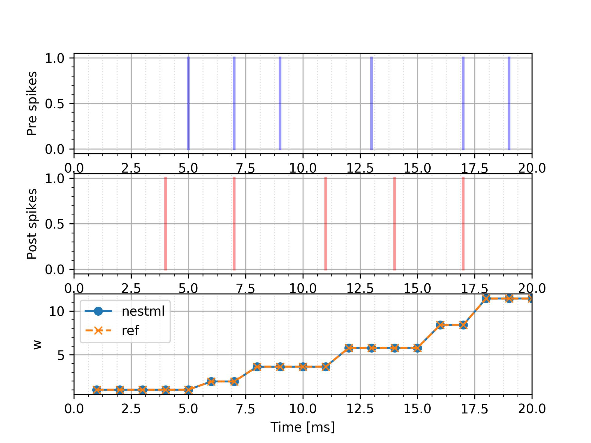
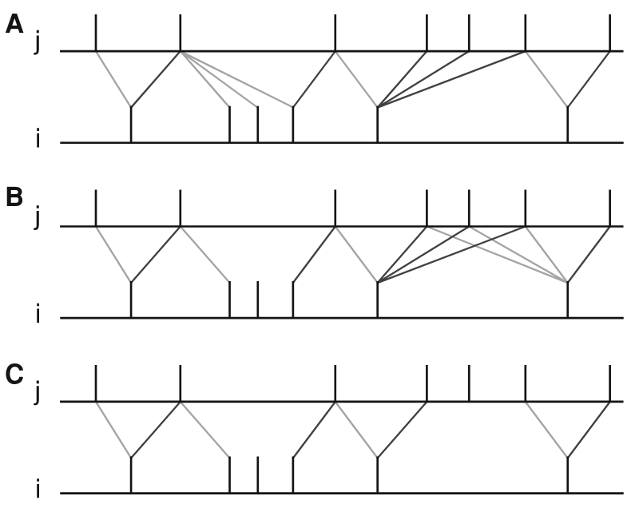

Modeling synapses in NESTML
===========================

A synapse is a special component in NESTML, because some simulators (notably, NEST) treat connections (edges) fundamentally differently from neurons (nodes).

The behaviour of a synapse is fundamentally determined by the `preReceive` block and the `deliver_spike(w, d)` function.

Writing the NESTML model
########################

preReceive
----------

The statements in this block will be triggered when a presynaptic spike arrives. These usually include a single call to `deliver_spike()` (but may include zero or more, e.g. in the case of an unreliable synapse or due to if..then..else statements).

deliver_spike(w, d) function
----------------------------

After a spike has been received in the `preReceive` block, the weight (and delay) of the neuron are, potentially, updated. The spike then needs to be passed on to the postsynaptic partner. This can be done by calling the `deliver_spike` function with the appropriate weight and delay. Example:

.. code::

    synapse static:
        parameters:
            w nS = 1 nS
            d ms = 1 ms
        end

        preReceive:
            deliver_spike(w, d)
        end
    end

Link to the simulator namespace
-------------------------------

When generating code, simulators such as NEST need to have a unique internal reference for the parameters that pass through the API involved with sending a spike, namely, the weight and delay of the connection. For this purpose, decorator keywords such as `@nest::weight` exist, which can be used to mark a parameter (which might have a name such as `w` or `wght`) as uniquely corresponding to the NEST namespace name `weight`. Example:

.. code:: 

    synapse static:

        parameters:
            w nS = 1 nS    @nest::weight
            d ms = 1 ms    @nest::delay
        end

        [...]
    end

Sharing parameters between synapses
-----------------------------------

If one or more synapse parameters are the same across a population (homogeneous), then sharing the parameter value between all synapses can save vast amounts of memory. To mark a particular parameter as homogeneous, use the `@homogeneous` decorator keyword. This can be done on a per-parameter basis. By default, parameters are heterogeneous and can be set on a per-synapse basis by the user. Example:

.. code:: 

    synapse static:

        parameters:
            a real = 3.14159   @homogeneous
            b real = 100.      @heterogeneous
        end

        [...]
    end

will lead to the following C++ code being generated:

.. code:: C++

    class static_connectionCommonSynapseProperties : public CommonSynapseProperties
    {
    public:

        static_connectionCommonSynapseProperties()
        : CommonSynapseProperties()
        {
            this->a = 3.14159; // as real
        }

        double a;

        [...]
    }

and

.. code:: C++

    class static_connection : public Connection
    {
    private:

        struct Parameters_{
            double b;
            [...]
        }

    public:
        static_connection() : ConnectionBase()
        {
            P_.b = 100.0; // as real
            [...]
        }

        [...]
    }

Generating code
###############

Co-generation of neuron and synapse
-----------------------------------

Why co-generation? ...

Just-in-time compilation/build

The NEST target
---------------

NEST target synapses are not allowed to have any internal dynamics (ODEs). This is due to the fact that synapses are, unlike nodes, not updated on a regular time grid.

Example: Spike-Timing Dependent Plasticity (STDP) synapse
#########################################################

   
   STDP synapse test

Example: STDP synapse with nearest-neighbour spike pairing
##########################################################

*See [stdp_nn.nestml](stdp_nn.nestml).*

stdp_synapse is a synapse with spike time dependent plasticity (as defined in [1]). The weight dependence exponent can be set separately for potentiation and depression; see [stdp](stdp_synapse.nestml) for detailed information and references.

This synapse model extends the [stdp](stdp_synapse.nestml) model by restrictions on interactions between pre- and post spikes.

   
   Figure 7 from Morrison, Diesmann and Gerstner

   Original caption:

   Phenomenological models of synaptic plasticity based on spike timing", Biological Cybernetics 98 (2008). "Examples of nearest neighbor spike pairing schemes for a pre-synaptic neuron j and a postsynaptic neuron i. In each case, the dark gray indicate which pairings contribute toward depression of a synapse, and light gray indicate which pairings contribute toward potentiation. **(a)** Symmetric interpretation: each presynaptic spike is paired with the last postsynaptic spike, and each postsynaptic spike is paired with the last presynaptic spike (Morrison et al. 2007). **(b)** Presynaptic centered interpretation: each presynaptic spike is paired with the last postsynaptic spike and the next postsynaptic spike (Izhikevich and Desai 2003; Burkitt et al. 2004: Model II). **(c)** Reduced symmetric interpretation: as in **(b)** but only for immediate pairings (Burkitt et al. 2004: Model IV, also implemented in hardware by Schemmel et al. 2006)

